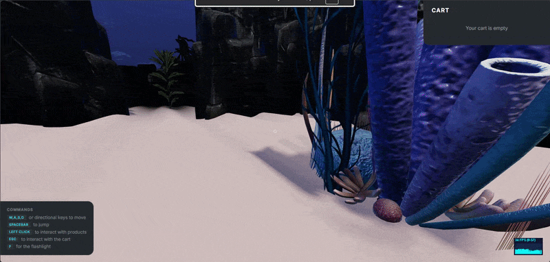

# Showroom 3D

A personal revamp of a project I built in a team during my Bachelor's degree in Computer Science. The app consists of a first-person 3D showroom where users could walk around, inspect products, and add them to a (fake) cart. It was already built with React, React Three Fiber, and Redux Toolkit, but the codebase had accumulated technical debt and performance issues that made it noticeably laggy.

This version is a rewrite focused on TypeScript, rendering performance, and a cleaner UI.

**[Live Demo →](https://showroom3d.rinos.dev/)**



## What changed from the original

### TypeScript migration

The entire codebase was converted from JavaScript (`.jsx`/`.js`) to TypeScript. This included typing all React components, Redux slices, Three.js object interactions, and custom hooks. Shared types like `Product`, `CartItem`, and `Decoration` are defined in a central `types.ts` and reused across the app.

### Performance

The original ran at well under 60 FPS. The main culprits were:

- **6 shadow-casting lights** — every shadow-casting light forces Three.js to re-render the entire scene from that light's perspective. The original had 4 spotlights and 2 directional lights all casting shadows. This was reduced to a single directional light, which alone had a large impact on frame rate.
- **Uncontrolled scene cloning** — each product and decoration called `glb.scene.clone()` at the top of the component body with no memoization, meaning a full scene graph clone was created and thrown away on every re-render. All clones are now wrapped in `useMemo`.
- **Raycaster dispatching every frame** — the raycaster was calling `dispatch()` on every animation frame regardless of whether the intersected object had changed, causing constant Redux state updates and re-renders throughout the component tree. It now only dispatches when the intersection actually changes.
- **New Three.js objects on every render** — `Lights` and `Flashlight` were allocating new `Vector3` and `Object3D` instances on every render, which caused continuous re-renders in a feedback loop. These are now created once with `useMemo`.
- **Physics capsule recreating on a timer** — the player's physics capsule had a Redux selector in its `useMemo` dependency array, causing it to be recreated every time the position was dispatched to the store (every 1.5s), which reset the physics state mid-game.
- **Model preloading** — models previously loaded sequentially as components rendered inside `<Suspense>`. All models are now preloaded at module level with `useGLTF.preload()`, starting all fetches simultaneously when the page loads.

### Color picker

The original had preset color variants (radio buttons for red, blue, green). This was replaced with a native `<input type="color">` picker, letting users choose any color. Colors are applied to the 3D model's materials in real time, with sRGB → linear color space conversion so the result matches what the picker shows.

### UI redesign

The entire UI was rebuilt around a consistent dark design system. Changes include:

- **Loading screen** — replaced the chunky native `<progress>` element with a thin glowing bar and a terminal-style log that shows each asset filename as it loads
- **Product sidebar** — redesigned with section dividers, uppercase labels, a live price that updates with quantity, and a close button
- **Cart** — fixed a scroll event listener memory leak, added an empty state, item count badge, and per-item card styling
- **Crosshair** — replaced the filled dot + messy CSS X with a clean ring that turns teal on product hover and a thin X on decorations
- **Commands panel** — moved to bottom-left, key bindings styled as chips, muted so it doesn't compete with the scene
- **Interaction prompt** — added a `CLICK` key badge and frosted glass background

## Tech stack

- React + TypeScript
- Three.js / React Three Fiber / React Three Drei
- Redux Toolkit
- Vite

## Controls

| Key          | Action            |
| ------------ | ----------------- |
| `W A S D`    | Move              |
| `Space`      | Jump              |
| `Left Click` | Inspect product   |
| `F`          | Toggle flashlight |
| `Esc`        | Exit product view |

## Run locally

```bash
npm install
npm run dev
```
